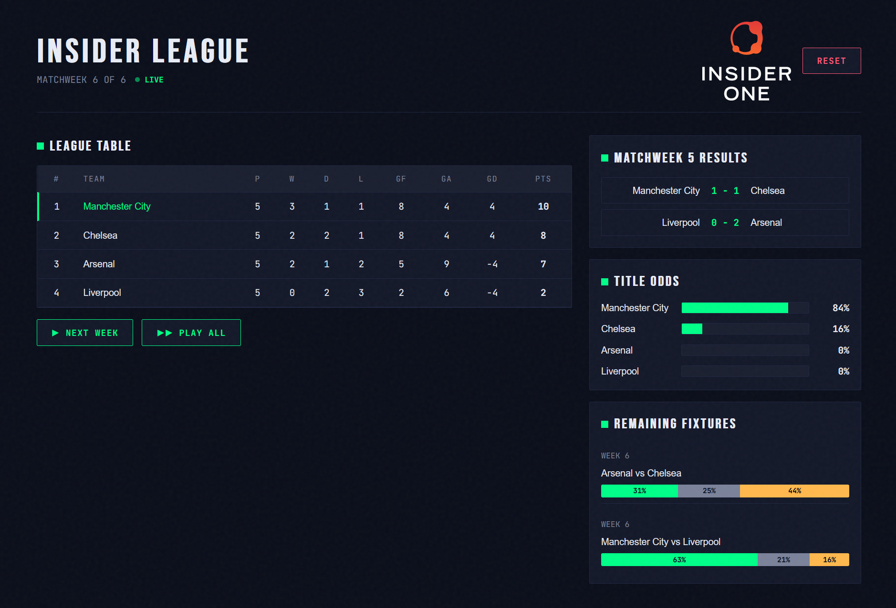
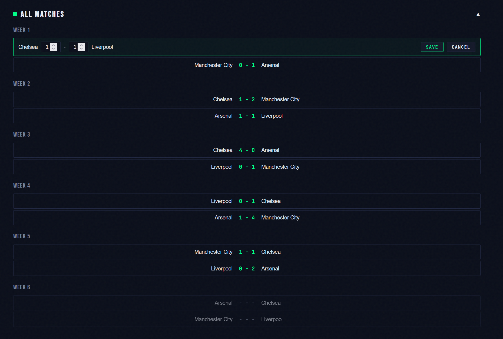

# Insider League Simulator

A REST API (and embedded frontend) in Go that simulates a 4-team football mini-league following Premier League rules. It generates round-robin fixtures, simulates match results using a Poisson-based engine, maintains a live league table with proper tiebreakers, and predicts championship probabilities via Monte Carlo simulation. Users can advance week-by-week, play all remaining weeks at once, or edit past results — standings and predictions recalculate automatically.

## Screenshots
<table>
  <tr>
    <td></td>
    <td></td>
  </tr>
</table>

## Prerequisites

- **Docker** (with Docker Compose v2)
- **Make** (optional — for shorthand commands)

## Quick Start

```bash
cp .env.example .env
docker compose up --build
```

Open http://localhost:8080 in your browser for the interactive frontend, or use the API endpoints below with curl/Postman.

**Live demo:** https://insideronebackendfullstack-production.up.railway.app/

## Features

- **Play all matches** — `POST /league/play-all` simulates every remaining week in one call and returns a per-week breakdown of results plus the final table and champion.
- **Edit match results** — `PUT /matches/{id}` updates a played match's score; standings and predictions recalculate automatically. The frontend supports inline editing by clicking any played match row.
- **Embedded web UI** — `GET /` serves a single-page UI embedded in the Go binary via `embed.FS`. No npm, no build step, no separate deployment. Mirrors the screens in the brief (table, results, championship odds) and adds a remaining-fixtures view with per-match outcome bars. Available at http://localhost:8080 after `docker compose up`.
- **Informative health endpoint** — `GET /health` returns diagnostic info: database ping status, league state (current week, matches played, season complete), app version and git commit, and uptime. Returns 503 when the database is unreachable. `GET /ready` is a lighter readiness probe (DB ping only) for orchestrators.
- **Per-match predictor** — `GET /predictions` returns per-match win probabilities (home win / draw / away win) and expected goals for every remaining unplayed match, alongside the existing championship odds. Both are computed in a single Monte Carlo pass — no extra simulation cost.

## Endpoints

| Method | Path | Description |
|--------|------|-------------|
| `GET` | `/` | Embedded web UI (no build step required) |
| `GET` | `/health` | Diagnostic endpoint: DB ping, league state, version, uptime (503 when DB is down) |
| `GET` | `/ready` | Lightweight readiness probe for orchestrators (DB ping only) |
| `POST` | `/league/reset` | Wipe season and regenerate fixtures |
| `GET` | `/league/table` | Current standings |
| `GET` | `/league/week` | Current week index + total weeks |
| `POST` | `/league/next-week` | Simulate next unplayed week |
| `POST` | `/league/play-all` | Simulate all remaining weeks; returns per-week results, final table, and champion |
| `GET` | `/matches` | All matches (filter: `?week=N`, `?played=true`) |
| `PUT` | `/matches/{id}` | Edit a played match's score; standings recalculate on next request |
| `GET` | `/predictions` | Championship odds + per-match win probabilities via Monte Carlo |

See [docs/api.md](docs/api.md) for detailed request/response examples.

## Running Tests

```bash
# With Go installed locally:
go test ./...

# Or via Docker (no local Go needed):
docker compose run --rm app go test ./...
```

## Architecture

```
┌──────────────────────────────────────────────────────────────┐
│                       HTTP Layer (chi)                        │
│          handlers_league / handlers_match / handlers_predict  │
└──────────────────────┬───────────────────────────────────────┘
                       │
┌──────────────────────▼───────────────────────────────────────┐
│                     Service Layer                             │
│         league.Service  /  predictor.MonteCarlo              │
└──────────┬───────────────────────────────────┬───────────────┘
           │                                   │
┌──────────▼──────────┐          ┌─────────────▼──────────────┐
│   Domain Layer      │          │    Simulator Layer          │
│ types, interfaces,  │          │  Poisson match engine       │
│ standings calculator │          │  (injected via interface)   │
└──────────┬──────────┘          └────────────────────────────┘
           │
┌──────────▼──────────────────────────────────────────────────┐
│              Repository Layer (postgres)                      │
│         team_repo.go  /  match_repo.go                       │
└──────────────────────┬───────────────────────────────────────┘
                       │
               ┌───────▼───────┐
               │  PostgreSQL   │
               └───────────────┘
```

All layers communicate through interfaces defined in `internal/domain/ports.go`. The simulator and RNG are injected, making the entire system deterministic and testable.

## Design Notes

### Why Poisson Distribution?

Real football goal-scoring closely follows a Poisson process — goals are rare, independent events. Each team's expected goals are derived from their strength rating adjusted for home advantage, then sampled from a Poisson distribution. This produces realistic scorelines (low-scoring draws, occasional upsets) without manual tuning.

### Why Monte Carlo Prediction?

With only 4 teams and 6 weeks, the remaining fixture space is small but the outcome combinations are large. Monte Carlo simulation (10,000 iterations by default) handles this elegantly: for each iteration, simulate all remaining matches with fresh randomness, compute final standings, and count championship wins. The result converges to accurate probabilities and naturally accounts for tiebreaker scenarios.

### Why Double Round-Robin?

The brief specifies Premier League rules with 4 teams. A double round-robin (each pair plays home and away) produces exactly 12 matches over 6 weeks — balanced, fair, and mirrors how real leagues operate. The circle algorithm generates fixtures with no team playing twice in the same week.

## Deployment

### Railway

Deployed at: https://insideronebackendfullstack-production.up.railway.app/

The app is configured for Railway out of the box:
- `railway.toml` in the repo root tells Railway to use the Dockerfile
- `DATABASE_URL` is read directly from the Railway-provided Postgres plugin
- `PORT` is injected by Railway and the app respects it
- Migrations run automatically on boot (`MIGRATE_ON_BOOT=true`)
- Fixtures are auto-seeded on first deploy with an empty database

To replicate:
1. Push repo to GitHub
2. Create a new Railway project → Deploy from GitHub Repo
3. Add a PostgreSQL plugin and reference `DATABASE_URL` in the app service variables
4. Set `MIGRATE_ON_BOOT=true` and `SIM_SEED=42`
5. Generate a domain under Settings → Networking

### Alternatives

**Fly.io**: Use `fly launch` with the existing Dockerfile. Add a Postgres cluster with `fly postgres create` and attach it. Set secrets via `fly secrets set`. The HEALTHCHECK in the Dockerfile works natively with Fly's health monitoring.

**Render**: Create a new Web Service pointing to the repo, select Docker runtime. Add a PostgreSQL instance from the Render dashboard and wire the connection env vars. Render respects the Dockerfile HEALTHCHECK for zero-downtime deploys.

## Project Structure

```
.
├── cmd/server/main.go              # Entrypoint, wiring, graceful shutdown
├── internal/
│   ├── domain/                     # Pure types, interfaces, standings calc
│   ├── simulator/                  # Poisson match engine
│   ├── predictor/                  # Monte Carlo championship odds
│   ├── league/                     # League service: fixtures, week flow
│   ├── repository/postgres/        # DB adapters
│   ├── httpapi/                    # Handlers, router, DTOs
│   └── config/                     # Env loading
├── web/static/                     # Embedded frontend (HTML/CSS/JS)
├── migrations/                     # SQL migrations
├── docs/                           # API docs, Postman collection
├── Dockerfile
├── docker-compose.yml
└── Makefile
```

## License

This project is a submission for the Insider Backend/Full-Stack Development Intern hiring case.
